# inteli-pose-estimation

Implementação de **pose estimation para bovinos** com base no **ANIMAL-POSE DATASET**, organizada conforme o enunciado.

O artefato principal de implementação está no notebook [animal_pose.ipynb](animal_pose.ipynb), que reúne:

- análise exploratória do dataset;
- filtragem e pré-processamento das imagens bovinas;
- treinamento e avaliação de um baseline de pose estimation;
- conclusões finais.

Todas as figuras abaixo foram geradas diretamente pelo notebook e salvas em `figures/`.

## 1. Análise Exploratória do ANIMAL-POSE DATASET

### Contexto do dataset

O arquivo `keypoints.json` corresponde ao conjunto anotado do Animal-Pose. No repositório local, porém, as imagens disponíveis representam apenas um subconjunto do dataset completo. Por isso, toda a etapa prática deste trabalho usa a interseção entre:

- as anotações do `keypoints.json`;
- os arquivos realmente presentes em `animalpose_image_part2/`;
- a subpasta `animalpose_image_part2/cow/` quando o objetivo é trabalhar apenas com bovinos.

### Resumo quantitativo

| Espécie | Anotações no JSON | Imagens únicas no JSON | Imagens locais no repositório |
| --- | ---: | ---: | ---: |
| dog | 1771 | 1529 | 200 |
| cat | 1466 | 1324 | 200 |
| sheep | 1078 | 556 | 200 |
| horse | 960 | 723 | 200 |
| cow | 842 | 534 | 200 |

Valores globais relevantes para este projeto:

- `4608` imagens referenciadas no JSON;
- `6117` anotações totais;
- `534` imagens únicas de bovinos no dataset anotado;
- `842` anotações de bovinos no JSON;
- `1000` imagens locais disponíveis no repositório;
- `200` arquivos de bovinos presentes em `cow/`;
- `200` anotações bovinas efetivamente processadas no notebook.

Em outras palavras: o JSON completo contém **534 imagens bovinas únicas**, mas o repositório local permite processar apenas **200** delas nesta etapa, o que corresponde a aproximadamente **37,5%** das imagens bovinas anotadas.

### Distribuição por espécie

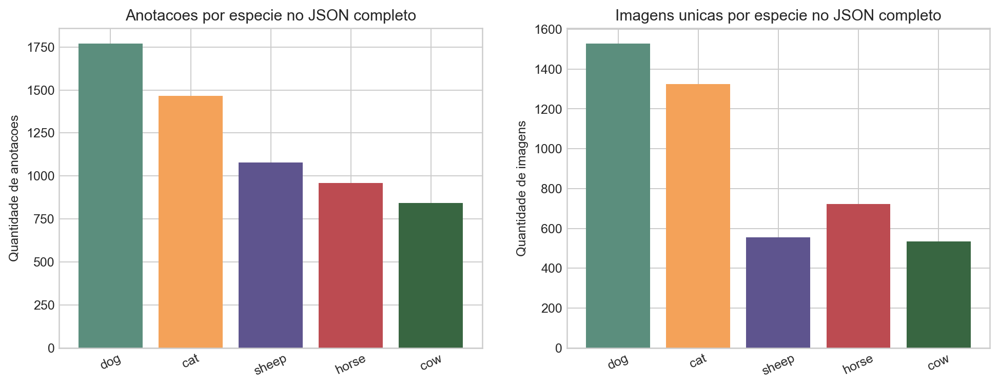

O gráfico da esquerda mostra a quantidade de anotações por espécie no JSON completo. O gráfico da direita mostra a quantidade de imagens únicas por espécie, o que é importante porque uma mesma imagem pode contribuir com mais de uma anotação.

Para bovinos, o ponto central da análise é que o dataset anotado contém **842 anotações** distribuídas em **534 imagens únicas**. Isso responde diretamente à exigência de destacar quantas imagens do dataset são de bovinos.

### Subconjunto bovino realmente disponível para processamento

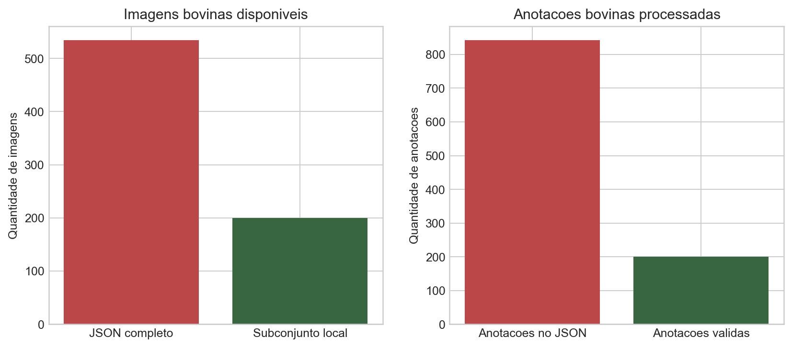

O repositório local não contém todas as imagens descritas no JSON. Por isso, o processamento prático precisou ser restrito ao subconjunto em disco: **200 imagens bovinas** e **200 anotações bovinas correspondentes**.

Esse recorte é metodologicamente importante porque evita erros de leitura de arquivos ausentes e mantém a análise coerente com o que pode ser reproduzido no ambiente local.

### Visibilidade dos keypoints

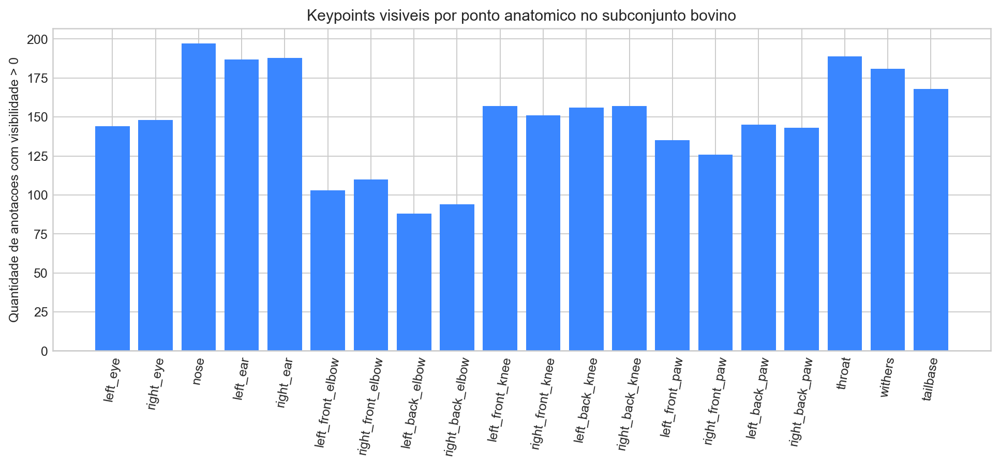

Esse gráfico mede, para cada um dos 20 keypoints da categoria `cow`, quantas anotações têm visibilidade maior que zero. Os keypoints mais frequentes foram `nose`, `throat`, `right_ear`, `left_ear` e `withers`, enquanto pontos periféricos das patas e articulações posteriores aparecem com menor frequência.

Isso sugere que extremidades e articulações laterais são mais sensíveis a oclusão, enquadramento e variação de pose, o que antecipa maior dificuldade na etapa de estimativa de pose.

### Estatísticas das bounding boxes

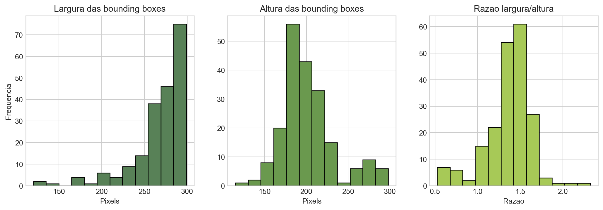

As caixas delimitadoras dos bovinos no subconjunto local têm largura entre `120` e `299` pixels, com média de `267,9` pixels. A altura varia entre `115` e `298` pixels, com média de `201,5` pixels. A razão largura/altura média foi `1,37`.

Isso indica que, no subconjunto local, os animais aparecem com frequência em enquadramentos relativamente amplos e predominantemente laterais, o que é coerente com um cenário inicial de pose estimation para pecuária bovina.

### Dimensões reais das imagens

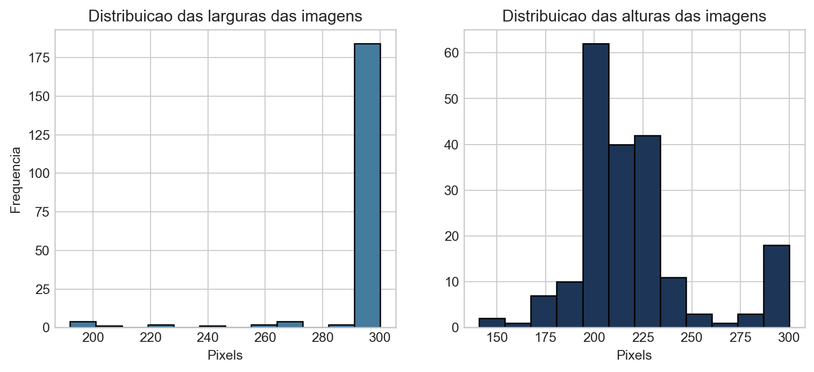

As imagens bovinas do subconjunto local têm largura entre `192` e `300` pixels, com média de `295,2` pixels, e altura entre `141` e `300` pixels, com média de `219,1` pixels.

Na prática, isso mostra que o subconjunto local é composto majoritariamente por imagens pequenas, reforçando a necessidade de um pipeline de recorte, padronização de escala e remapeamento dos keypoints.

### Amostra visual das poses anotadas

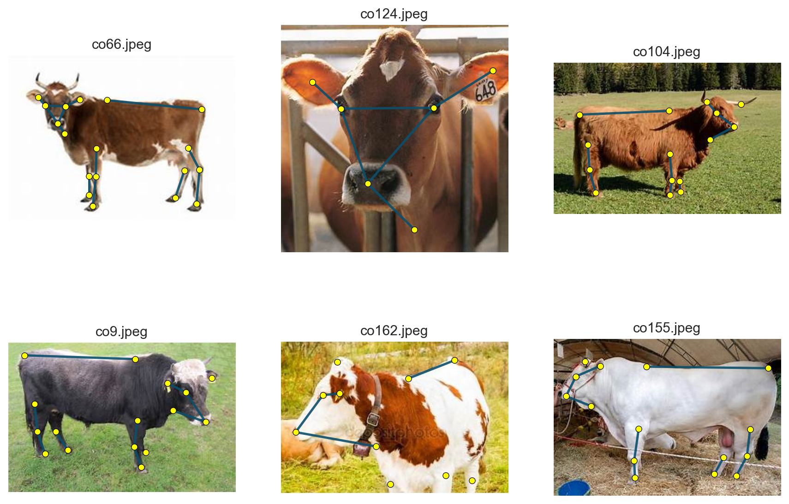

Essa grade visual confirma que as anotações de keypoints acompanham adequadamente a estrutura corporal dos bovinos disponíveis localmente. A figura também evidencia diversidade de orientação, postura e ocupação do quadro.

## 2. Filtragem do dataset para bovinos e processamento de imagem

### Regra de filtragem adotada

Somente imagens de bovinos são processadas no notebook. A filtragem foi implementada em duas etapas:

1. manter apenas anotações com `category_id == 5`, que correspondem à categoria `cow`;
2. manter apenas os casos cujo nome do arquivo anotado também existe fisicamente em `animalpose_image_part2/cow/`.

Com isso, o pipeline evita inconsistências entre JSON e disco e garante que todo item processado seja reproduzível localmente.

### Etapas de processamento de imagem

Após a filtragem bovina, cada amostra passa pelo seguinte fluxo:

1. leitura da imagem original associada ao `image_id`;
2. leitura da `bbox` no formato COCO `[x_min, y_min, largura, altura]`;
3. recorte da região do animal com margem adicional de `10%` para preservar contexto;
4. aplicação de padding até formar uma imagem quadrada, evitando distorção geométrica excessiva;
5. redimensionamento da imagem quadrada para `256x256` pixels;
6. remapeamento dos keypoints do sistema de coordenadas original para o novo sistema da imagem processada;
7. uso da imagem padronizada como entrada do baseline de pose estimation.

### Figura ilustrativa do pipeline

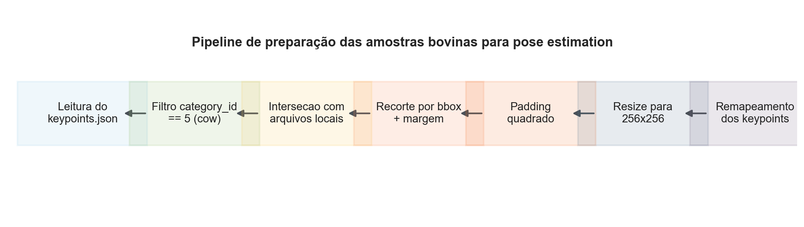

A figura resume o fluxo completo, desde o carregamento do `keypoints.json` até a produção de uma imagem bovina padronizada em `256x256` com keypoints remapeados.

Esse pipeline foi escolhido porque combina simplicidade, reprodutibilidade e compatibilidade com uma etapa supervisionada de pose estimation baseada em regressão das coordenadas dos keypoints.

### Exemplo detalhado passo a passo

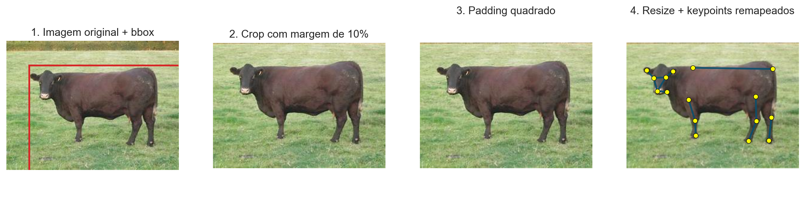

O exemplo fixo usa a imagem `co1.jpeg` e mostra todas as transformações aplicadas. Os valores numéricos do exemplo foram:

1. Imagem original: `300x225` pixels.
2. Bounding box original: `[39, 42, 265, 184]`.
3. Recorte com margem de `10%`: `crop_box = (13, 16, 300, 225)`, resultando em um recorte de `287x209`.
4. Padding quadrado: a imagem recortada foi centralizada em uma área de `287x287`.
5. Resize final: a área quadrada foi redimensionada para `256x256`.
6. Exemplo de keypoints remapeados:
   `nose -> [45.49, 106.15, 1]`
   `tailbase -> [216.75, 73.14, 1]`

Esse exemplo mostra que a transformação não afeta apenas a imagem, mas também as coordenadas dos keypoints. O remapeamento é essencial para manter a correspondência espacial correta entre a anatomia do animal e a nova representação processada.

## 3. Resultados finais do processamento e da estimativa de pose

### Configuração do baseline

Para a etapa de estimativa de pose foi utilizado um baseline em **PyTorch** com **MobileNetV3-Small** e transferência de aprendizado. O pipeline final foi:

- entrada: imagens bovinas processadas em `256x256`;
- saída: `20 x 2` coordenadas normalizadas dos keypoints bovinos;
- split: `160` imagens para treino e `40` para validação;
- epochs: `12`;
- otimizador: `Adam`;
- função de perda: `Smooth L1` mascarada, calculada apenas sobre keypoints visíveis.

Durante a execução registrada no notebook, os pesos pré-treinados foram carregados com sucesso e o treinamento foi realizado em `cpu`, com fallback automático para `mps` quando disponível.

### Curvas de treinamento

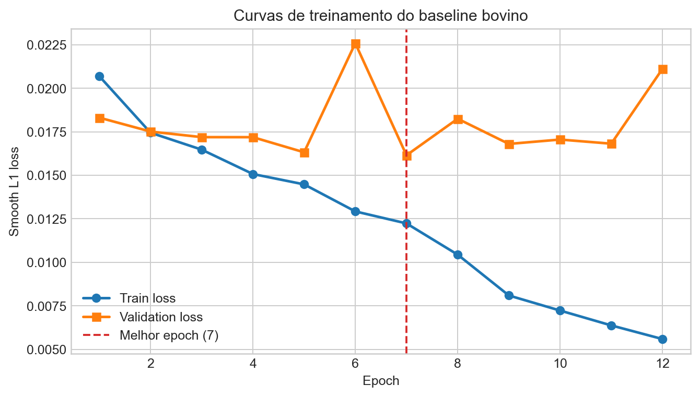

As curvas mostram queda consistente da perda de treino ao longo das épocas e uma validação que melhora rapidamente no início, atingindo o melhor valor na **época 3**. Depois disso, a perda de validação oscila, o que é esperado em um subconjunto pequeno de apenas 200 imagens locais.

### Tabela-resumo dos resultados

| Métrica | Valor |
| --- | ---: |
| Imagens de treino | 160 |
| Imagens de validação | 40 |
| Keypoints visíveis na validação | 597 |
| Melhor época | 3 |
| Melhor `val_loss` | 0.0169 |
| `MAE` normalizado | 0.1342 |
| `MAE` em pixels | 34.35 |
| `PCK@0.05` | 0.069 |
| `PCK@0.10` | 0.206 |

Os resultados mostram que o baseline aprendeu um padrão útil, mas ainda apresenta erro considerável. Isso é coerente com o tamanho reduzido do subconjunto, a diversidade de poses e a dificuldade dos keypoints periféricos.

### Erro por keypoint

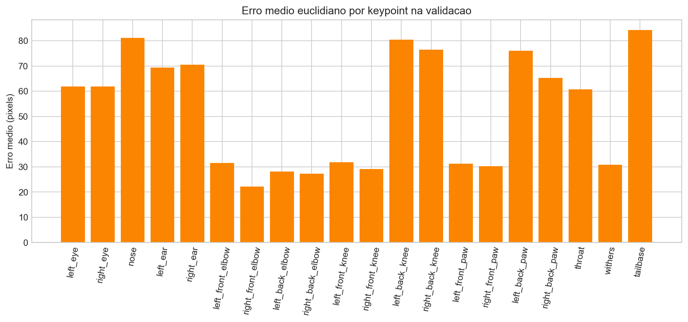

O gráfico de erro por keypoint ajuda a entender quais partes do corpo são mais difíceis para o modelo. No experimento registrado:

- o keypoint com **maior erro médio** foi `tailbase`, com **88.64 px**;
- o keypoint com **menor erro médio** foi `left_back_elbow`, com **21.05 px**.

Esse comportamento sugere que pontos mais extremos e sujeitos a oclusão ou truncamento, como a base da cauda, ainda são desafiadores para o baseline.

### Exemplos qualitativos

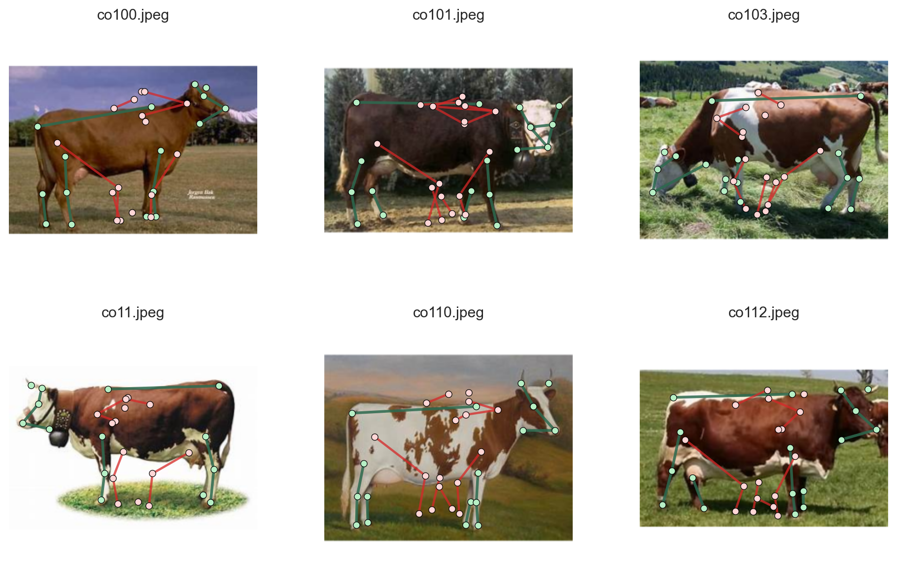

Nos exemplos acima, o esqueleto de referência aparece em verde e a predição do modelo em vermelho. Visualmente, o baseline já consegue capturar parte da estrutura global do animal, especialmente em regiões centrais do tronco e da cabeça, mas ainda erra com frequência a localização fina de extremidades e pontos posteriores.

Em resumo, a etapa 3 mostra que o pipeline de filtragem e pré-processamento é suficiente para viabilizar um primeiro experimento de pose estimation bovina, mesmo que os resultados ainda sejam de caráter inicial.

## 4. Conclusões

O principal aprendizado deste trabalho foi que a transição de um projeto genérico de pose estimation para uma aplicação focada em **pecuária bovina** exige menos uma troca simples de dataset e mais a construção de um pipeline especializado para a anatomia e o enquadramento dos bovinos.

Entre os aprendizados mais importantes, destacam-se:

- a filtragem correta do dataset é essencial para garantir consistência entre anotações e imagens realmente disponíveis;
- o pré-processamento com recorte por `bbox`, padding quadrado e remapeamento dos keypoints foi decisivo para padronizar a entrada do modelo;
- mesmo com um subconjunto pequeno, o uso de transferência de aprendizado permitiu construir um baseline funcional e mensurável.

As principais limitações do trabalho foram:

- uso de apenas `200` imagens bovinas locais, embora o JSON contenha `534` imagens únicas de bovinos anotadas;
- avaliação baseada em um único split treino/validação;
- uso de regressão direta de coordenadas, uma abordagem mais simples do que modelos baseados em heatmaps ou arquiteturas específicas para pose estimation.

Como sugestões de trabalhos futuros:

1. ampliar o subconjunto de treinamento para cobrir uma fração maior do Animal-Pose;
2. aplicar data augmentation orientado a keypoints;
3. testar arquiteturas mais apropriadas para pose estimation, como abordagens baseadas em heatmaps;
4. comparar diferentes estratégias de fine-tuning e métricas adicionais de avaliação.

Como resultado final, o repositório entrega uma implementação reproduzível de **pose estimation para bovinos**, documentada no `README.md` e implementada integralmente em [animal_pose.ipynb](animal_pose.ipynb).
